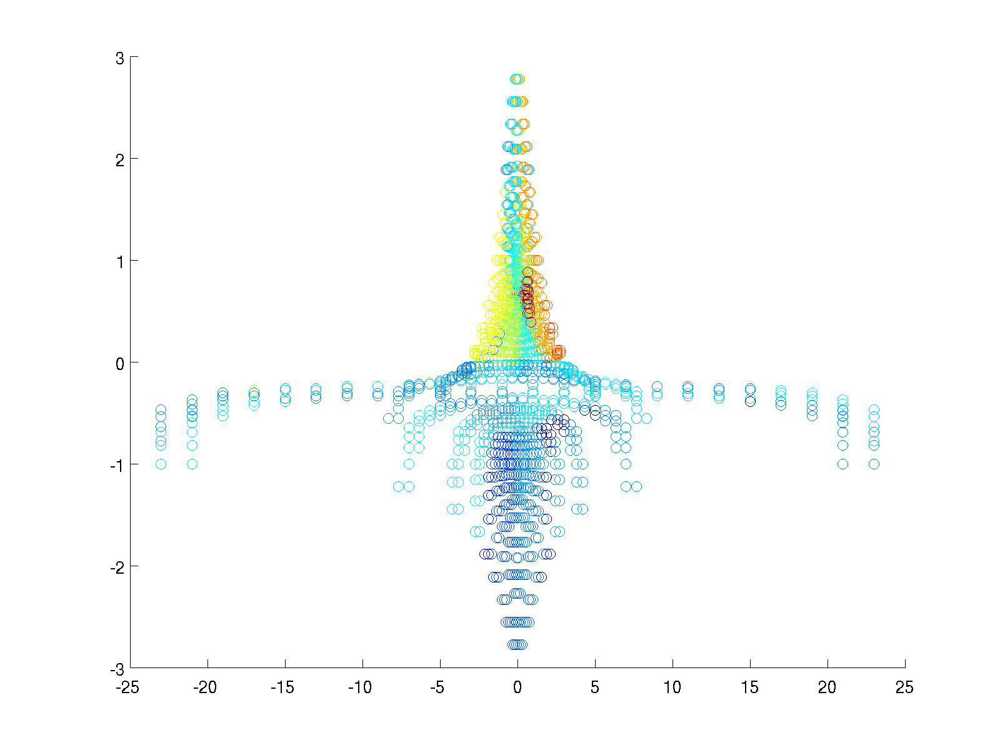

## To-Do ##
* Correlation values
* Find a way to print isosurfaces without corruption
* Animation

## History ##
* [September 5: Vx vs Vx](#september-5-2016)
* [September 1: Correlation plots?](#september-1-2016)
* [August 31: First 3D attempts](#august-31-2016)

* * *
### September 5, 2016 ###
Correlation of model-predicted V_x using solar wind input V_x:

Correlation of Ionospheric region (2.8-3 R_E):

Attempt at a [stereographic projection](https://www.uwgb.edu/dutchs/STRUCTGE/sphproj.htm):

### September 1, 2016 ###
Trying to make correlation plots. This takes quite a while and 5.5GB of memory. This is manageable with scatter3, but isosurface and contourslice require regridding to a meshgrid format which returns "Maximum variable size allowed by the program is exceeded."

Two examples of attempts to plot with scatter3 though:

Or only looking at points with correlations between 0.9+-0.01:

Note that just looking at cutplanes doesn't reveal much of use, and an eps plots including every point take up 50+MB (and it's been generating a png for like 40 minutes so far and won't abort so calling it a night with this for now).

### August 31, 2016 ###
Beginning by trying to extend correlation tests to 3D space. This runs into a few issues: First being that Brian's code pre-cuts data into slices, so either the original cdf must be used, or his code must be run for each desired slice. I've chosen the former.

The next problem is that the original cdf is on a non-uniform grid with increasing grid density nearer to the Earth, and consists of over 1M grid points for 97 time steps. Even if we only take x,y,z,bx,by,bz, and rho, that's ~800Mb of memory just for storage. This is largely unavoidable because even if I interpolate to a uniform 100x100x100 grid, that's still the same size, but this does make the actual plots a bit nicer to look at.
 
For example, using scatter3 with interpolated data: 

Versus using the original non-uniform grid:

It's also possible to use MATLAB's isosurface to directly draw a surface at a certain value, though this requires inputs in the form of a meshgrid which is (I think) easier if the grid is already uniform. Example (note this is a screen-grabbed png because MATLAB 2014a refuses to print the figure without it coming out corrupt. Known issue, and usually setting facelighting to 'phong' avoids it, but not in this case for some reason):

Next step will be actual correlation values and any issues with keeping all of that data in memory/running it through least squares.
