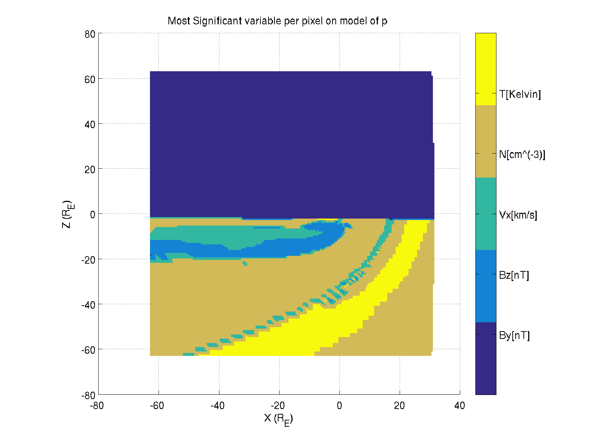

## To-Do ##
* Lots of code comments (including workflow)
* Clean and optimize code
* 1 lag 30 min vs 1 lag 10 minute
* 6 coef 0 lag vs 1 coef 0 lag for 10 minute cadence

* * *
### January 23, 2017 ###
Since the correlations seemed particularly low for the RhoVx^2 and VxBs models, we wanted to test if it was just that neither were great for predicting Vx.

Bz from 1-lag RhoVx^2 | VxBs | Both
:--:|:--:|:--:
 |  | 

P from 1-lag RhoVx^2 | VxBs | Both
:--:|:--:|:--:
 |  | 

Rho from 1-lag RhoVx^2 | VxBs | Both
:--:|:--:|:--:
 |  | 

This suggests that density is well predicted by a combination of density and velocity, which makes sense, except for the fact that velocity wasn't well predicted by that same combination (albeit squared, and this is a linear model). Also shows that most of the correlation for these models comes from one of the two components, and doubling the number of inputs doesn't gain much in the way of correlation just from having an extra parameter to fit.

##### Best Parameter with Normalization #####

Attempting to determine the most useful variable at each location was previously discrepant between R^2 and using the coefficients directly. To address that, the models were adjusted so that the inputs were all normalized as (y-mean_y)/sigma_y, and then significance was again determined as the maximum coefficient.

Vx: Significant inputs from coef | Significant inputs from coef/mean | Significant inputs from R^2
:--:|:--:|:--:
 |  | 

Bz: Significant inputs from coef | Significant inputs from coef/mean | Significant inputs from R^2
:--:|:--:|:--:
 |  | 

Rho: Significant inputs from coef | Significant inputs from coef/mean | Significant inputs from R^2
:--:|:--:|:--:
 |  | 

P: Significant inputs from coef | Significant inputs from coef/mean | Significant inputs from R^2
:--:|:--:|:--:
 |  | 

*Note the last two had an issue with crashing at the halfway point. Since been fixed (there's a section in the middle where values don't change for the whole run, so the std() is 0, so (y-ybar)/std is undefined and crashes), just haven't re-run them yet.*

These plots show that the normalized method is at least a lot closer to the same result as R^2 than previously, but still isn't quite exactly the same. The question is whether it should be for a multivariate case, since R^2 is calculated directly between each variable (treated independently) and the output, whereas the IR model coefficients can account for colinearity.

[This page](https://stats.stackexchange.com/questions/61818/generalised-least-squares-from-regression-coefficients-to-correlation-coefficie) seems to suggest that this should be the case for general least squares solutions where all predictors aren't completely independent. That said, it isn't clear yet if the standardized coefficients are still adequate indicators of which predictors are best or not. More research forthcoming.

[Additional Wiki article on this.](https://en.wikipedia.org/wiki/Coefficient_of_determination#As_squared_correlation_coefficient)

## Prior Notes ##
Moved to a **[different file](PriorNotes.md)** to save loading times.
