## To-Do ##
* Correlation values
* Find a way to print isosurfaces without corruption
* Animation

## History ##
* [November 8: Ten minute data](#november-8-2016)
* [October 26: One minute data](#october-26-2016)
* [October 17: 3D Correlation Plots](#october-17-2016)
* [September 27: Optimization](#september-27-2016)
* [September 5: Vx vs Vx](#september-5-2016)
* [September 1: Correlation plots?](#september-1-2016)
* [August 31: First 3D attempts](#august-31-2016)

* * *
### November 8, 2016 ###
Looking at the 8 days of 10-minute cadence data with a 10-lag IR model shows relatively high correlations:

Vx | Bz
:--:|:--:
 | 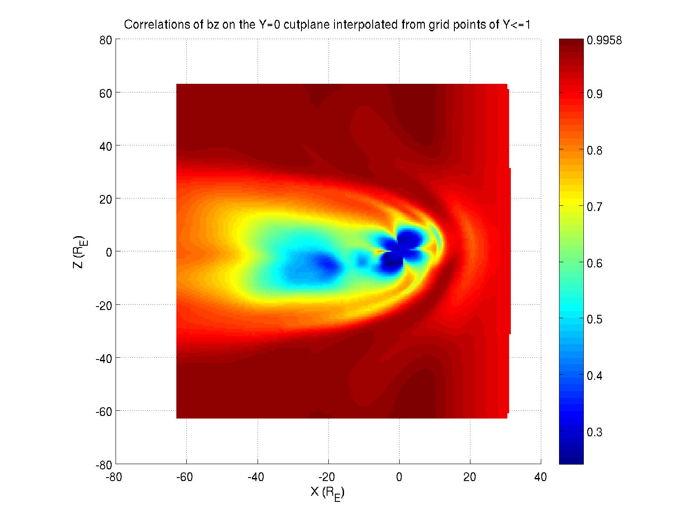

Rho | P
:--:|:--:
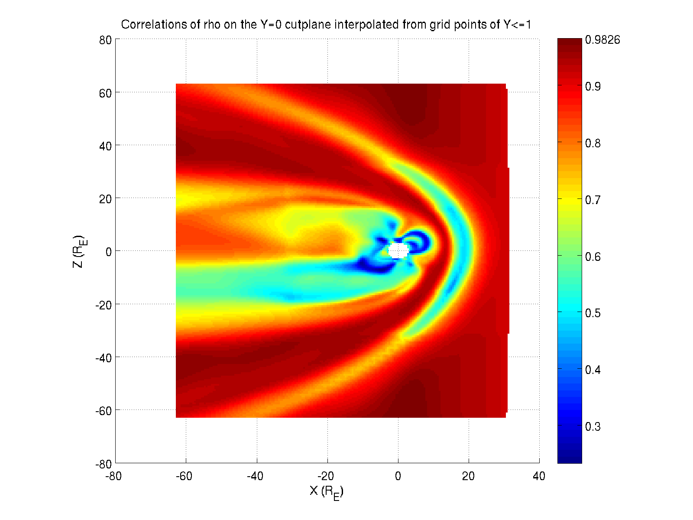 | 

*Note for future reference with this model: The run was originally started with 1-minute cadence, then switched over because it caused issues on the CCMC side. They ended up providing roughly two days of 1-minute data followed by six days of 10-minute data, but the solar wind data was 1-minute the whole way through. Both had to be organized onto the same timescale, and I did that by keeping every cdf file and solar wind entry with a minute ending in 0 (e.g. 1:30, 1:40, 1:50, 2:00). There were also two cdf files (at least. Two with minutes ending in 0) occurring on the same time step, but different endings (e.g. 3d\__var_1_e20100101-065000-304.out and 3d__var_1_e20100101-065000-391.out), so not knowing the significance I just kept the lower numbered version.*

### October 26, 2016 ###
Looking at the results for the CCMC run with one-minute cadence produces the following plots.

#### Regression ####
Bx | By | Bz
:--:|:--:|:--:
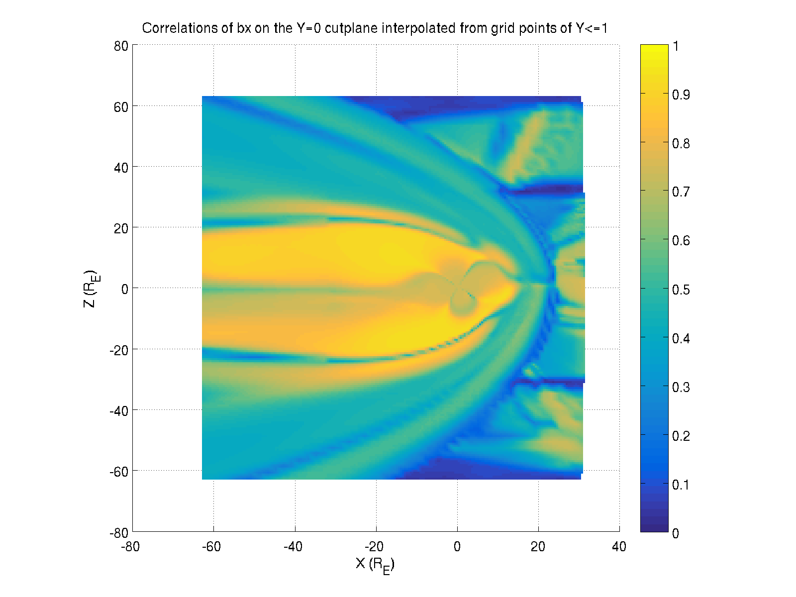 | 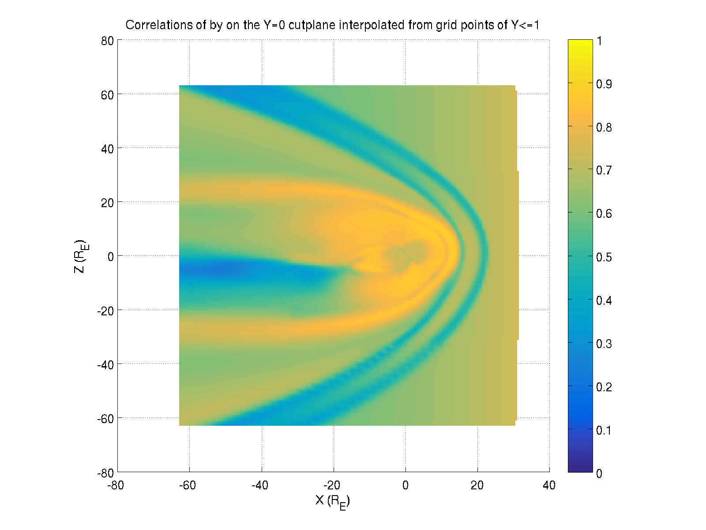 | 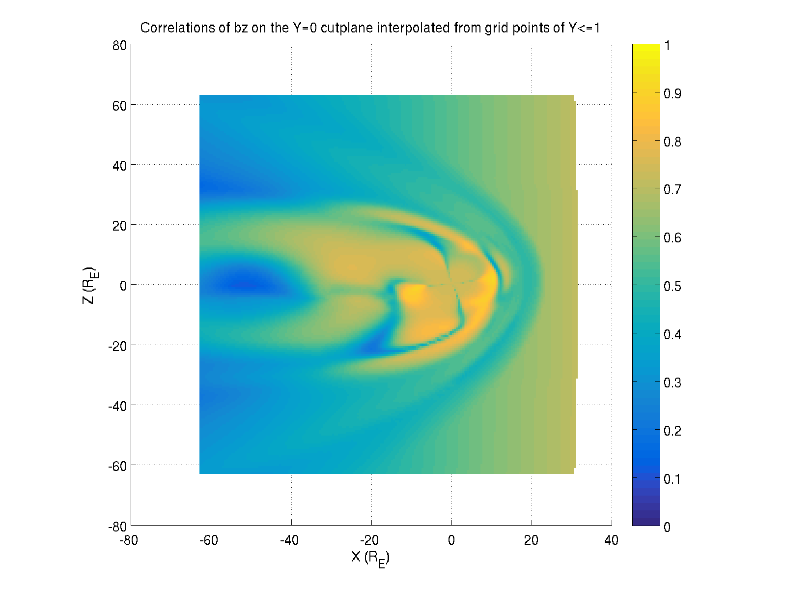

Vx | Vy | Vz
:--:|:--:|:--:
 |  | 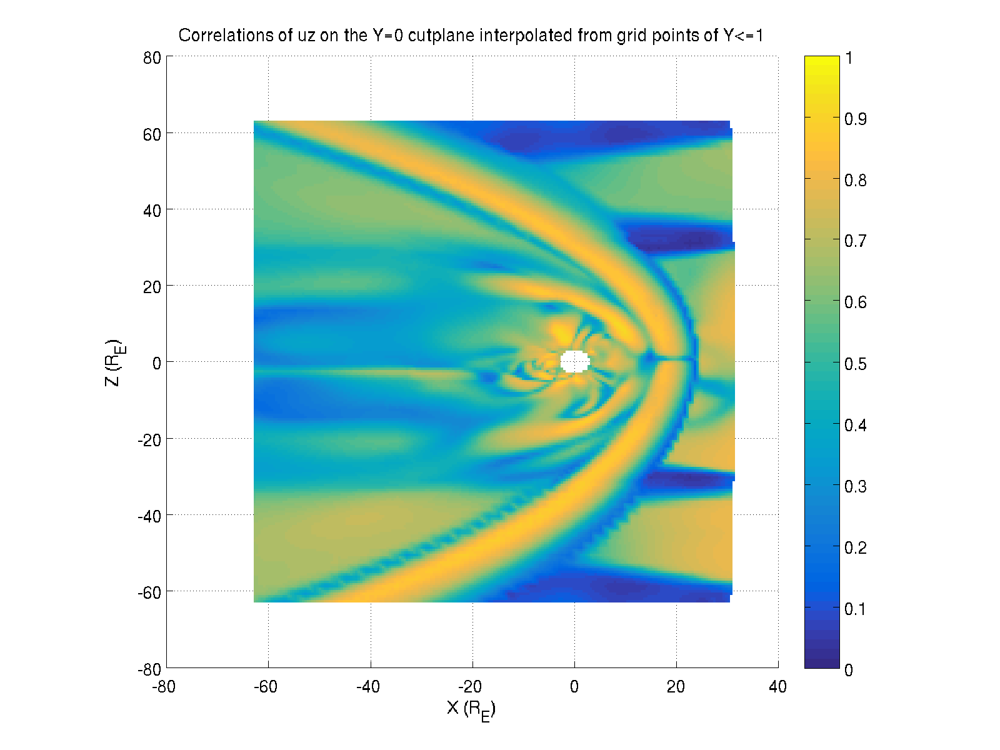

Jx | Jy | Jz
:--:|:--:|:--:
 | 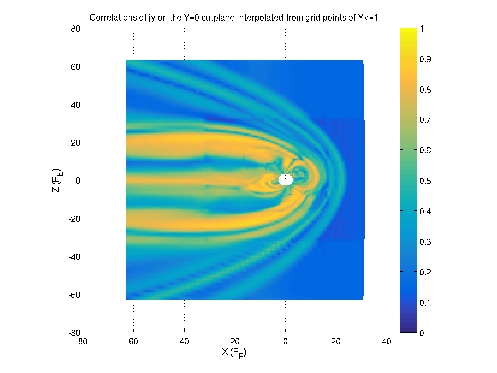 | 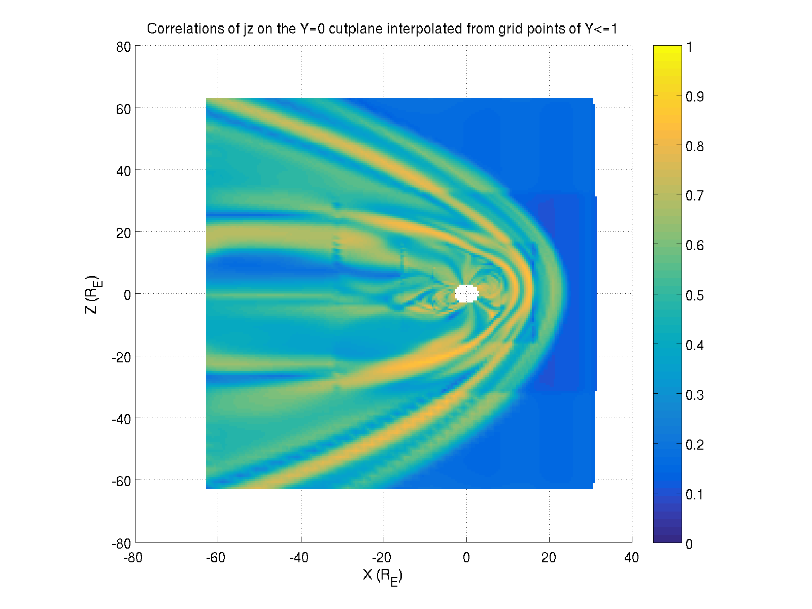

P | Rho
:--:|:--:
 | 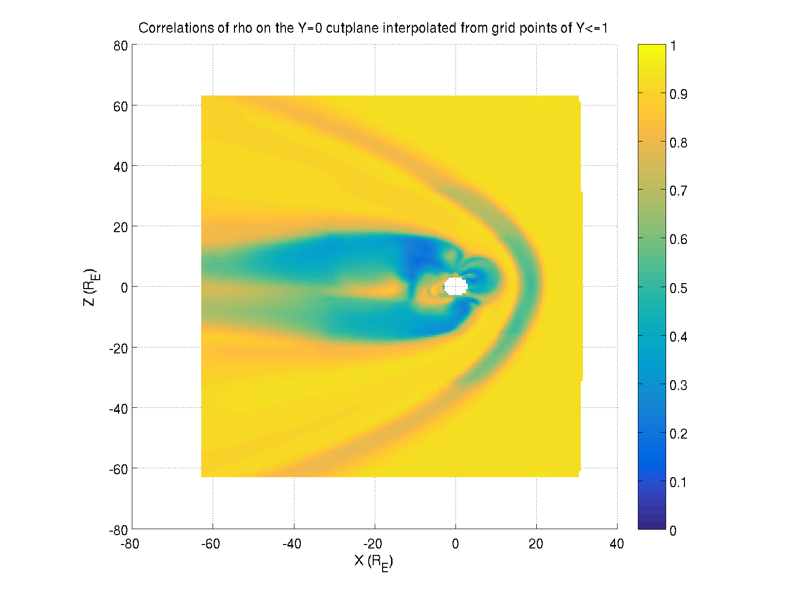

#### 10 1-minute lags ####
*Note that this is **Vx** and **By, Bz**, just in one row to minimize giant figures*

Vx | By | Bz
:--:|:--:|:--:
 |  | 

Jx | Jy | Jz
:--:|:--:|:--:
 |  | 

Rho:

I'm still generating more plots, but this requires regenerating all the mat files (and finding more ways to free up hard drive space and deal with corrupt mat files from when it runs out), and now generating a correlation matrix for each variable, which takes ~1 hour each for the full solar wind input model. Will update here when they  complete.

### October 17, 2016 ###
Turns out the cdf files for each timestep in a run don't keep consistent ordering of rows. Sorting each cdf file by X, Y, and Z results in a matrix that can be correlated row-wise through time. The following figures use a 10-lag (5 hour) impulse response model of V_x given all solar wind B components, V components, N, and T. Since there are no grid points at Y=0, here are the closest values at Y=0.125:

Or a plot taking all points and interpolating/projecting them onto the Y=0 cutplane:
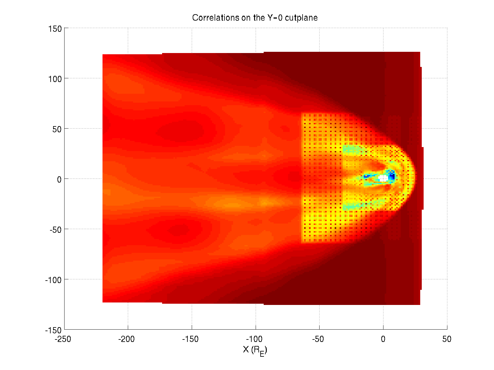

I'm still investigating whether these odd grid patterns are from the interpolation or if there is still some issue with rows. The few files I checked all had the same grid points after sorting, but perhaps this changes somewhere through the run.

If I only use the points with values of abs(Y)<=1 for the interpolation, I get something more sensible:

I've also made gifs to visualize the entire 3D space. The first one plotting each unique Y cutplane with its own scale so you can see the structure, and the second plotting them with set axes to see how the grid changes size and shape at each step in Y value.

#### Regression ####

Doing this same thing for a linear regression model (x_t=a*f_t+c where f is all solar wind inputs) gets an interpolated Y=0 cutplane like this:
 

 Or only interpolating from grid points of Y<=1:
 

 and the actual correlations of nearest points:

 

### September 27, 2016 ###
Looking into [large file handling](http://www.matlabtips.com/how-to-store-large-datasets/) and [volume visualization](https://www.mathworks.com/help/matlab/volume-visualization.html)

Code now saves X,Y,Z, and correlations for each point based on what model inputs and outputs you select, saving 30+ minutes of reading and calculations on subsequent runs.

Can make plots using triangular tesselation and tri-versions of plots (e.g. trisurf, trimesh). Example of ionosphere plot:

### September 5, 2016 ###
Correlation of model-predicted V_x using solar wind input V_x:
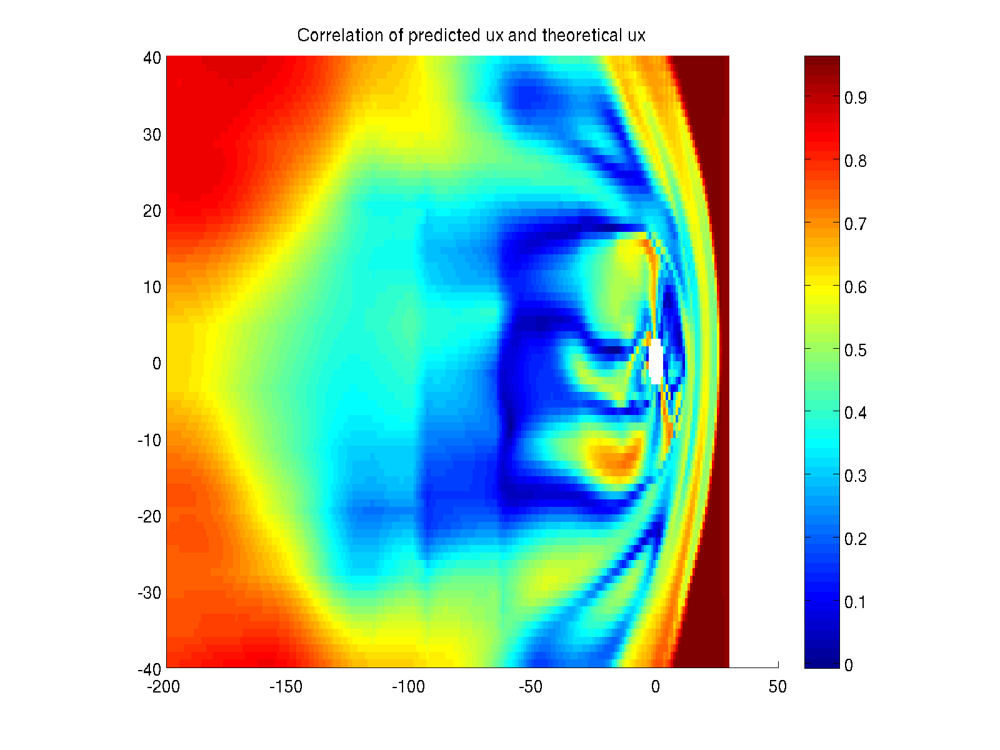

Correlation of Ionospheric region (2.8-3 R_E):

Attempt at a [stereographic projection](https://www.uwgb.edu/dutchs/STRUCTGE/sphproj.htm):

Top and bottom hemispheres of the ionosphere cut:

### September 1, 2016 ###
Trying to make correlation plots. This takes quite a while and 5.5GB of memory. This is manageable with scatter3, but isosurface and contourslice require regridding to a meshgrid format which returns "Maximum variable size allowed by the program is exceeded."

Two examples of attempts to plot with scatter3 though:

Or only looking at points with correlations between 0.9+-0.01:

Note that just looking at cutplanes doesn't reveal much of use, and an eps plots including every point take up 50+MB (and it's been generating a png for like 40 minutes so far and won't abort so calling it a night with this for now).

### August 31, 2016 ###
Beginning by trying to extend correlation tests to 3D space. This runs into a few issues: First being that Brian's code pre-cuts data into slices, so either the original cdf must be used, or his code must be run for each desired slice. I've chosen the former.

The next problem is that the original cdf is on a non-uniform grid with increasing grid density nearer to the Earth, and consists of over 1M grid points for 97 time steps. Even if we only take x,y,z,bx,by,bz, and rho, that's ~800Mb of memory just for storage. This is largely unavoidable because even if I interpolate to a uniform 100x100x100 grid, that's still the same size, but this does make the actual plots a bit nicer to look at.

For example, using scatter3 with interpolated data:

Versus using the original non-uniform grid:

It's also possible to use MATLAB's isosurface to directly draw a surface at a certain value, though this requires inputs in the form of a meshgrid which is (I think) easier if the grid is already uniform. Example (note this is a screen-grabbed png because MATLAB 2014a refuses to print the figure without it coming out corrupt. Known issue, and usually setting facelighting to 'phong' avoids it, but not in this case for some reason):

Next step will be actual correlation values and any issues with keeping all of that data in memory/running it through least squares.
